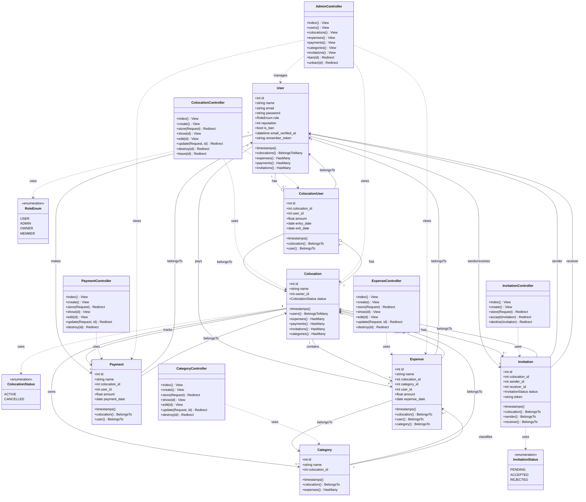

# Diagramme de Classes — EasyColoc

```mermaid
classDiagram

    %% ─────────────── ENUMS ───────────────
    class RoleEnum {
        <<enumeration>>
        USER
        ADMIN
        OWNER
        MEMBER
    }

    class ColocationStatus {
        <<enumeration>>
        ACTIVE
        CANCELLED
    }

    class InvitationStatus {
        <<enumeration>>
        PENDING
        ACCEPTED
        REJECTED
    }

    %% ─────────────── MODELS ───────────────
    class User {
        +int id
        +string name
        +string email
        +string password
        +RoleEnum role
        +int reputation
        +bool is_ban
        +datetime email_verified_at
        +string remember_token
        +timestamps()
        +colocations() BelongsToMany
        +expenses() HasMany
        +payments() HasMany
        +invitations() HasMany
    }

    class Colocation {
        +int id
        +string name
        +int owner_id
        +ColocationStatus status
        +timestamps()
        +users() BelongsToMany
        +expenses() HasMany
        +payments() HasMany
        +invitations() HasMany
        +categories() HasMany
    }

    class ColocationUser {
        +int id
        +int colocation_id
        +int user_id
        +float amount
        +date entry_date
        +date exit_date
        +timestamps()
        +colocation() BelongsTo
        +user() BelongsTo
    }

    class Expense {
        +int id
        +string name
        +int colocation_id
        +int category_id
        +int user_id
        +float amount
        +date expense_date
        +timestamps()
        +colocation() BelongsTo
        +user() BelongsTo
        +category() BelongsTo
    }

    class Category {
        +int id
        +string name
        +int colocation_id
        +timestamps()
        +colocation() BelongsTo
        +expenses() HasMany
    }

    class Payment {
        +int id
        +string name
        +int colocation_id
        +int user_id
        +float amount
        +date payment_date
        +timestamps()
        +colocation() BelongsTo
        +user() BelongsTo
    }

    class Invitation {
        +int id
        +int colocation_id
        +int sender_id
        +int receiver_id
        +InvitationStatus status
        +string token
        +timestamps()
        +colocation() BelongsTo
        +sender() BelongsTo
        +receiver() BelongsTo
    }

    %% ─────────────── CONTROLLERS ───────────────
    class ColocationController {
        +index() View
        +create() View
        +store(Request) Redirect
        +show(id) View
        +edit(id) View
        +update(Request, id) Redirect
        +destroy(id) Redirect
        +leave(id) Redirect
    }

    class ExpenseController {
        +index() View
        +create() View
        +store(Request) Redirect
        +show(id) View
        +edit(id) View
        +update(Request, id) Redirect
        +destroy(id) Redirect
    }

    class PaymentController {
        +index() View
        +create() View
        +store(Request) Redirect
        +show(id) View
        +edit(id) View
        +update(Request, id) Redirect
        +destroy(id) Redirect
    }

    class CategoryController {
        +index() View
        +create() View
        +store(Request) Redirect
        +show(id) View
        +edit(id) View
        +update(Request, id) Redirect
        +destroy(id) Redirect
    }

    class InvitationController {
        +index() View
        +create() View
        +store(Request) Redirect
        +accept(Invitation) Redirect
        +decline(Invitation) Redirect
    }

    class AdminController {
        +index() View
        +users() View
        +colocations() View
        +expenses() View
        +payments() View
        +categories() View
        +invitations() View
        +ban(id) Redirect
        +unban(id) Redirect
    }

    %% ─────────────── RELATIONS ENTRE MODELS ───────────────

    User "1" --o "0..*" ColocationUser : has
    Colocation "1" --o "0..*" ColocationUser : has
    ColocationUser --> User : belongsTo
    ColocationUser --> Colocation : belongsTo

    User "1" --> "0..*" Expense : pays
    User "1" --> "0..*" Payment : makes
    User "1" --> "0..*" Invitation : sends/receives

    Colocation "1" --> "0..*" Expense : contains
    Colocation "1" --> "0..*" Payment : tracks
    Colocation "1" --> "0..*" Invitation : has
    Colocation "1" --> "0..*" Category : owns

    Expense --> Category : belongsTo
    Expense --> User : belongsTo
    Expense --> Colocation : belongsTo

    Payment --> User : belongsTo
    Payment --> Colocation : belongsTo

    Invitation --> Colocation : belongsTo
    Invitation --> User : sender
    Invitation --> User : receiver

    Category --> Colocation : belongsTo
    Category "1" --> "0..*" Expense : classifies

    %% ─────────────── RELATIONS CONTROLLERS ↔ MODELS ───────────────
    ColocationController ..> Colocation : uses
    ColocationController ..> ColocationUser : uses
    ExpenseController ..> Expense : uses
    PaymentController ..> Payment : uses
    CategoryController ..> Category : uses
    InvitationController ..> Invitation : uses
    AdminController ..> User : manages
    AdminController ..> Colocation : views
    AdminController ..> Expense : views
    AdminController ..> Payment : views

    %% ─────────────── ENUM USAGE ───────────────
    User ..> RoleEnum : uses
    Colocation ..> ColocationStatus : uses
    Invitation ..> InvitationStatus : uses
```
