# Diagramme de Cas d'Utilisation — EasyColoc

```mermaid
flowchart TD
    %% ─────────────── ACTEURS ───────────────
    Guest([" Visiteur\n(Guest)"])
    User([" Utilisateur\n(User)"])
    Member([" Membre\n(Member)"])
    Owner([" Propriétaire\n(Owner)"])
    Admin([" Admin Global\n(Admin)"])

    %% ─────────────── CAS D'UTILISATION : AUTHENTIFICATION ───────────────
    subgraph AUTH [" Authentification"]
        UC1["S'inscrire"]
        UC2["Se connecter"]
        UC3["Se déconnecter"]
        UC4["Mettre à jour le profil"]
    end

    %% ─────────────── CAS D'UTILISATION : COLOCATION ───────────────
    subgraph COLOC [" Gestion de Colocation"]
        UC5["Créer une colocation"]
        UC6["Voir ses colocations"]
        UC7["Voir les détails d'une colocation"]
        UC8["Modifier la colocation"]
        UC9["Annuler la colocation"]
        UC10["Quitter la colocation"]
    end

    %% ─────────────── CAS D'UTILISATION : INVITATION ───────────────
    subgraph INVITE [" Gestion des Invitations"]
        UC11["Inviter un membre"]
        UC12["Voir les invitations reçues"]
        UC13["Accepter une invitation"]
        UC14["Refuser une invitation"]
    end

    %% ─────────────── CAS D'UTILISATION : DÉPENSES ───────────────
    subgraph EXPENSE [" Gestion des Dépenses"]
        UC15["Ajouter une dépense"]
        UC16["Voir les dépenses"]
        UC17["Modifier une dépense"]
        UC18["Supprimer une dépense"]
        UC19["Filtrer dépenses par mois"]
    end

    %% ─────────────── CAS D'UTILISATION : CATÉGORIES ───────────────
    subgraph CATEGORY [" Gestion des Catégories"]
        UC20["Créer une catégorie"]
        UC21["Voir les catégories"]
        UC22["Modifier une catégorie"]
        UC23["Supprimer une catégorie"]
    end

    %% ─────────────── CAS D'UTILISATION : BALANCES ───────────────
    subgraph BALANCE [" Balances & Remboursements"]
        UC24["Voir les soldes des membres"]
        UC25["Voir qui doit à qui"]
    end

    %% ─────────────── CAS D'UTILISATION : PAIEMENTS ───────────────
    subgraph PAYMENT [" Paiements"]
        UC26["Marquer un paiement comme effectué"]
        UC27["Voir l'historique des paiements"]
    end

    %% ─────────────── CAS D'UTILISATION : ADMIN ───────────────
    subgraph ADMINDASH [" Administration Globale"]
        UC28["Voir les statistiques globales"]
        UC29["Voir tous les utilisateurs"]
        UC30["Bannir un utilisateur"]
        UC31["Débannir un utilisateur"]
        UC32["Voir toutes les colocations"]
        UC33["Voir toutes les dépenses"]
        UC34["Voir tous les paiements"]
    end

    %% ─────────────── RELATIONS ACTEURS → CAS ───────────────

    %% Guest
    Guest --> UC1
    Guest --> UC2

    %% User (authenticated, no colocation)
    User --> UC2
    User --> UC3
    User --> UC4
    User --> UC5
    User --> UC6
    User --> UC12
    User --> UC13
    User --> UC14

    %% Member (dans une colocation)
    Member --> UC3
    Member --> UC4
    Member --> UC6
    Member --> UC7
    Member --> UC10
    Member --> UC12
    Member --> UC13
    Member --> UC14
    Member --> UC15
    Member --> UC16
    Member --> UC19
    Member --> UC24
    Member --> UC25
    Member --> UC26
    Member --> UC27

    %% Owner (hérite de Member + gestion colocation)
    Owner --> UC7
    Owner --> UC8
    Owner --> UC9
    Owner --> UC10
    Owner --> UC11
    Owner --> UC15
    Owner --> UC16
    Owner --> UC17
    Owner --> UC18
    Owner --> UC19
    Owner --> UC20
    Owner --> UC21
    Owner --> UC22
    Owner --> UC23
    Owner --> UC24
    Owner --> UC25
    Owner --> UC26
    Owner --> UC27

    %% Admin (hérite de tout + admin)
    Admin --> UC28
    Admin --> UC29
    Admin --> UC30
    Admin --> UC31
    Admin --> UC32
    Admin --> UC33
    Admin --> UC34
    Admin --> UC5
    Admin --> UC6
    Admin --> UC7

    %% ─────────────── STYLE ───────────────
    style AUTH fill:#1e3a5f,stroke:#4a9eff,color:#fff
    style COLOC fill:#1a3a2a,stroke:#4aff9e,color:#fff
    style INVITE fill:#3a2a1a,stroke:#ff9e4a,color:#fff
    style EXPENSE fill:#3a1a2a,stroke:#ff4aaa,color:#fff
    style CATEGORY fill:#2a1a3a,stroke:#9e4aff,color:#fff
    style BALANCE fill:#1a2a3a,stroke:#4aaeff,color:#fff
    style PAYMENT fill:#3a3a1a,stroke:#ffee4a,color:#fff
    style ADMINDASH fill:#3a1a1a,stroke:#ff4a4a,color:#fff
```

---

##  Description des Acteurs

| Acteur | Description |
|---|---|
| **Visiteur (Guest)** | Utilisateur non authentifié. Peut uniquement s'inscrire ou se connecter. |
| **Utilisateur (User)** | Utilisateur authentifié sans colocation active. Peut créer une colocation ou accepter une invitation. |
| **Membre (Member)** | Utilisateur membre d'une colocation. Peut gérer les dépenses, paiements et balances. |
| **Propriétaire (Owner)** | Créateur de la colocation. Hérite des droits Member + peut inviter/retirer des membres et gérer les catégories. |
| **Admin Global (Admin)** | Administrateur plateforme (premier inscrit). A accès aux statistiques globales et à la modération. Peut aussi être Owner/Member. |

---

##  Récapitulatif des Cas d'Utilisation

| # | Cas d'Utilisation | Acteur(s) |
|---|---|---|
| UC1 | S'inscrire | Guest |
| UC2 | Se connecter | Guest, User |
| UC3 | Se déconnecter | User, Member, Owner |
| UC4 | Mettre à jour le profil | User, Member, Owner |
| UC5 | Créer une colocation | User, Admin |
| UC6 | Voir ses colocations | User, Member, Owner, Admin |
| UC7 | Voir les détails d'une colocation | Member, Owner, Admin |
| UC8 | Modifier la colocation | Owner |
| UC9 | Annuler la colocation | Owner |
| UC10 | Quitter la colocation | Member, Owner |
| UC11 | Inviter un membre | Owner |
| UC12 | Voir les invitations reçues | User, Member |
| UC13 | Accepter une invitation | User, Member |
| UC14 | Refuser une invitation | User, Member |
| UC15 | Ajouter une dépense | Member, Owner |
| UC16 | Voir les dépenses | Member, Owner |
| UC17 | Modifier une dépense | Owner |
| UC18 | Supprimer une dépense | Owner |
| UC19 | Filtrer par mois | Member, Owner |
| UC20 | Créer une catégorie | Owner |
| UC21 | Voir les catégories | Owner |
| UC22 | Modifier une catégorie | Owner |
| UC23 | Supprimer une catégorie | Owner |
| UC24 | Voir les soldes | Member, Owner |
| UC25 | Voir qui doit à qui | Member, Owner |
| UC26 | Marquer un paiement | Member, Owner |
| UC27 | Voir l'historique des paiements | Member, Owner |
| UC28 | Voir les statistiques globales | Admin |
| UC29 | Voir tous les utilisateurs | Admin |
| UC30 | Bannir un utilisateur | Admin |
| UC31 | Débannir un utilisateur | Admin |
| UC32 | Voir toutes les colocations | Admin |
| UC33 | Voir toutes les dépenses | Admin |
| UC34 | Voir tous les paiements | Admin |
